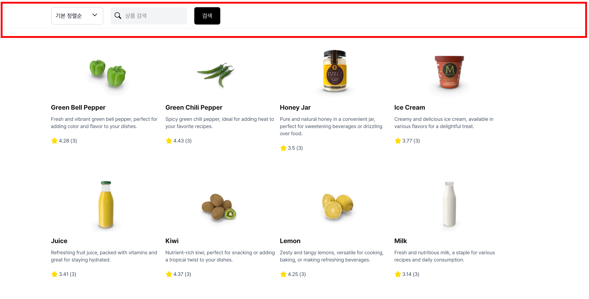

# WEEBUR: 상품 리스트 사이트

상품 데이터를 활용하여, 상품 리스트 페이지를 구현한 과제입니다.

## 개요

- 기술 스택
- 설치 및 실행 방법
- 프로젝트 구조
- 구현 기능
- 프로젝트 진행하며 집중한 부분
- 회고

<br>

## 기술 스택

- React
- Next.js
- TypeScript
- TailwindCSS

<br>

## 실행 방법

1. 필요한 패키지를 설치합니다.
   ```
   npm install
   ```
2. 서버를 실행합니다.
   ```
   npm run dev
   ```
3. 브라우저에 접속합니다. [http://localhost:3000/](http://localhost:3000/)

<br>

## 프로젝트 구조

```
├─ app
│  ├─ apis                        # API 폴더
│  │  └─ fetchProducts.tsx        # 상품 조회 API
│
│  ├─ components                  # 컴포넌트
│  │  ├─ Dropdown.tsx             # 드롭다운 컴포넌트
│  │  ├─ Header.tsx               # 헤더 컴포넌트
│  │  ├─ LayoutToggle.tsx         # 레이아웃 관련 토글 컴포넌트
│  │  ├─ LoadingSpinner.tsx       # 로딩 스피너 컴포넌트
│  │  ├─ ProductList.tsx          # 상품 목록 영역 컴포넌트
│  │  ├─ ProductListContent.tsx   # 상품 목록 내용 컴포넌트
│  │  ├─ SearchForm.tsx           # 검색 필터 컴포넌트
│  │  ├─ ToastMessage.tsx         # 토스트 메시지 컴포넌트
│  │  └─ layout                   # 레이아웃 관련 폴더
│  │     ├─ GridLayout.tsx        # 그리드 방식 컴포넌트
│  │     └─ ListLayout.tsx        # 리스트 방식 컴포넌트
│  │
│  ├─ constants                   # 상수 파일
│  │  └─ constants.ts             # 상수화 파일
│  │
│  ├─ hooks                       # 커스텀 훅
│  │  └─ useLayoutType.ts         # 레이아웃 타입 설정 훅
│  │
│  ├─ layout.tsx                  # 레이아웃
│  ├─ page.tsx                    # 상품 리스트 페이지
│  ├─ provider.tsx                # React-query 설정
│  │
│  └─ types                       # TypeScript 타입 정의
│     ├─ product.ts               # 상품 관련 타입 정의
│     └─ search.ts                # 검색 필터 관련 타입 정의
```

<br>

## 기능 구현 체크리스트

### UI

- [x] 페이지 진입 시 20개의 아이템이 기본으로 노출되어야 한다
- [x] 각 아이템은 다음 항목을 포함해야 한다
  - [x] 상품명 (`title`)
  - [x] 상품설명 (`description`)
  - [x] 썸네일 이미지 (`thumbnail`)
  - [x] 별점 (`rating`)
  - [x] 리뷰 수 (`reviews`)
- [x] View 방식 구현
  - [x] 리스트형 (List): 한 줄에 1개 아이템
  - [x] 그리드형 (Grid): 한 줄에 4개 아이템
- [x] View 표시 조건
  - [x] 페이지 최초 진입 시 50% 확률로 랜덤하게 View 방식 결정
  - [x] 결정된 방식은 24시간 동안 유지
  - [x] 이후 다시 랜덤 결정

### 데이터 가져오기

- [x] [DummyJSON Products API](https://dummyjson.com/docs/products#products-all)로 데이터 불러오기

### 페이지네이션

- [x] `limit`과 `skip` 파라미터를 사용하여 페이지네이션 구현

### 검색 필터

- [x] [search API](https://dummyjson.com/docs/products#products-search)를 사용한 문자열 검색 기능 구현
- [x] [sort API](https://dummyjson.com/docs/products#products-sort)를 사용한 별점(`rating`) 내림차순 정렬 기능 구현
- [x] 필터는 `form` 요소를 사용하여 구현
  - [x] 검색 버튼 포함
  - [x] 페이지 새로고침 후에도 필터 값 유지
  - [x] 검색 결과가 없을 경우 `"일치하는 결과가 없습니다."` 문구 표시

### 무한 스크롤

- [x] 페이지 하단 도달 시 다음 20개의 아이템 자동 로드
- [x] 필터 적용 상태에서도 무한 스크롤 동작
- [x] 마지막 데이터까지 로딩되면 `"더 이상 불러올 수 없습니다."` 문구 표시

<br>

## 구현 화면

### 1. 리스트형 목록 화면


### 2. 그리드형 목록 화면


### 3. 불러올 데이터가 없는 경우의 화면


### 4. 데이터가 없는 경우의 화면


<br>

## 프로젝트 진행하며 집중한 부분

### 1. 검색 필터 최상단 배치

많은 웹사이트가 사용자의 편의성과 성능을 고려하여 무한 스크롤 방식을 적용하고 있습니다. 사용자가 스크롤을 내릴수록 자동으로 데이터를 불러오는 방식은 매우 직관적이고 편리하지만, 검색 조건을 잊게 되는 단점이 있습니다.

저 또한 다양한 사이트를 사용하면서 이러한 불편함을 자주 경험했습니다. 특히 검색 필터를 적용한 뒤 많은 목록의 상품들을 탐색하다 보면, 어느 순간 "내가 어떤 조건으로 검색했었지?"라는 생각이 들며 다시 최상단까지 스크롤을 올리는 상황이 발생하곤 했습니다. 이러한 불편함이 사용자의 탐색 흐름을 방해하고, 사이트 이탈로 이어질 수 있다는 점을 직접 경험할 수 있었습니다.

이러한 문제를 반영하여 이번 과제에서는 검색 필터 영역을 페이지 상단에 고정하는 방식을 적용했습니다. 스크롤을 내리더라도 검색 필터 영역이 항상 상단에 고정되도록 구현함으로써, 사용자가 현재 적용된 필터 조건을 언제든지 쉽게 확인하고, 빠르게 수정할 수 있도록 했습니다.

이처럼 자주 겪었던 불편함을 개선함으로써, 사용자에게 더 나은 탐색을 제공하고자 했습니다. 작은 구현이지만, 사용자 관점에서 더 편안하게 콘텐츠를 탐색할 수 있는 환경을 만드는 데 집중하고자 했습니다.
<br>

| 평소 불편함을 느꼈던 사이트의 화면                                    | 구현한 화면                                                           |
| --------------------------------------------------------------------- | --------------------------------------------------------------------- |
|  |  |
| 스크롤시, 가려진 검색 필터                                            | 스크롤시, 상단에 고정된 검색 필터                                     |

<br>

### 2. 리액트 쿼리를 통해 구현한 무한 스크롤

무한 스크롤은 사용자가 자연스럽게 데이터를 이어서 확인할 수 있어, 콘텐츠 소비 흐름이 끊기지 않는다는 장점이 있습니다.

저는 이 기능을 구현하기 위해 React Query의 useInfiniteQuery 훅을 사용했습니다. 브라우저에서 제공하는 IntersectionObserver만으로도 스크롤 감지를 통해 데이터를 요청할 수 있지만, React Query를 함께 활용하면 중복 요청 방지, 로딩 상태 관리 등 데이터 요청을 보다 효율적이고 안정적으로 처리할 수 있다고 판단했습니다.

특히 React Query는 페이지네이션 방식의 데이터 흐름을 구조화할 수 있어, 다음 페이지가 로드되었는지 여부나 추가 데이터를 불러올 수 있는지에 대한 상태를 일관되게 관리할 수 있는 장점을 가지고 있습니다. 이러한 구조 덕분에 사용자는 끊김 없이 부드럽게 콘텐츠를 탐색할 수 있는 경험을 할 수 있도록 구현했습니다.

<br>


<br>

## 회고

이번 과제는 사용자 입장에서 더 편리한 방식은 무엇일까에 대해 고민하는데 시간을 소요했습니다. 무한 스크롤과 검색 필터 고정과 같은 기능도 단순히 구현하는 데에 그치지 않고, 제가 평소 직접 체감했엇던 불편함을 개선한 방식을 적용하려고 노력했습니다.

또한 이번 과제를 계기로 처음으로 React Query의 useInfiniteQuery를 활용해보며, 데이터 상태 관리와 페이지 네이션 흐름에 대한 이해도 함께 넓힐 수 있었습니다. 기술적으로도, UX 측면에서도 더 깊게 생각할 수 있었던 값진 시간이었습니다.

마지막으로, 저에게 이 과제를 진행할 수 있는 기회를 주셔서 감사합니다.
